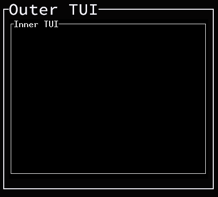

# Ratrioshka
_The Rat-in-Rat experience._

A Ratatui widget that lets you add Ratatui to your Ratatui.



This thing runs a separate terminal with soft-ratatui backend, 
renders it to a pixel buffer and displays the resulting image
as a Ratatui widget using ratatui-image.

## Usage

Don't. This is not published to crates.io for good reasons.
The code is terrible, this was coded at 2 AM during a Linux conference.
Additionally, I don't see any good use case for such thing.

...but I can't stop you:

```rust
fn render(frame: &mut Frame) {

    let inner_tui = Ratrioshka::new(|inner_frame| {
        inner_frame.render_widget(Block::bordered().title("Inner TUI"), inner_frame.area())
    });

    let outer_block = Block::bordered().title("Outer TUI");

    frame.render_widget(&outer_block, frame.area());
    frame.render_widget(
        inner_tui,
        outer_block.inner(frame.area())
    )
}
```

## Examples

```shell
cargo run --example basic
```
